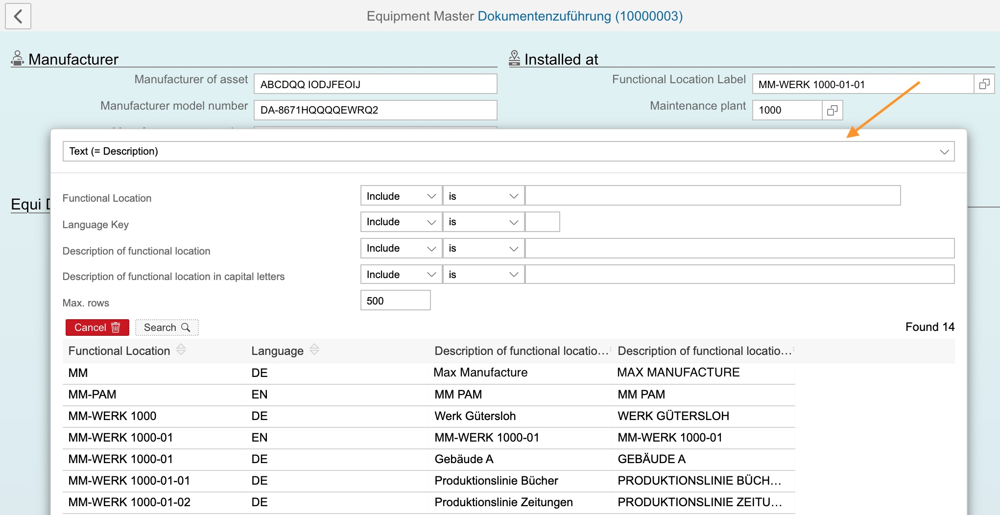

# fundamental-shelp

[](https://api.reuse.software/info/github.com/SAP/fundamental-shelp)

[fundamental-tools](https://github.com/SAP/fundamental-tools) app server component, exposing ABAP Value Input Helps:

- Field Domain Values
- Elementary and Complex Search Helps
- Custom Lookups

Consumed by [SAP Fundamental Styles](https://github.com/SAP/fundamental-styles) frontend components, over `shlp` custom attribute.

The attribute can be added by [fundamental-tools](https://github.com/SAP/fundamental-tools), modified or added by developer to any frontend component:

```html
<!-- Complex/Elementary Help of SH type -->
<!-- prettier-ignore -->
<ui-input ddic-length="18" ddic-type="CHAR" label="Equipment #"
  value.bind="installDetail.equiId"
  shlp.bind="{type: 'SH', id: 'EQUI', blacklist: 'SH EQUIR', autoselect: 'SH EQUIT'}"
>
</ui-input>

<!-- Complex/Elementary Help of CT/CH type -->
<!-- prettier-ignore -->
<ui-combo clear ddic-length="1" ddic-type="CHAR" mid="EQT"
  label="Equipment category"
  value.bind="equipment.ES_SPECIFIC.EQUICATGRY"
  shlp.bind="{type: 'CT', id: 'T370T'}"
>
</ui-combo>

<!-- Fixed Domain Values -->
<!-- prettier-ignore -->
<ui-input data-abap.bind="{ddic:'CHAR', type:'string', length:1}"
  label="Partial/Final Confirmation"
  value.bind="serviceOrder.confirmation.FIN_CONF"
  shlp.bind="{type:'FV', id:'AUERU_VS'}"
>
</ui-input>
```

The run-time implementation may look like:



# Prerequisites

The component is currently implemented in Python, running on Python app servers, with [PyRFC](https://github.com/SAP/PyRFC).

Three remote enabled ABAP Function Modules (RFMs) are required in ABAP backend system (any release). The example implementation is given in [abap-helpers](abap-helpers), not maintained or supported in this repository.

Supported platforms: Windows, Linux, macOS.

# Installation

```shell
$ pip install fundamental-pyshlp
```

The development version can be installed from current master

```shell
$ git clone https://github.com/SAP/pyshlp.git
$ cd pyshlp
$ python setup.py install
```

# Usage

Beside consumption by frontend components' custom `shlp` attribute, the Python interpreter can be used for interactive CLI testing and experimenting.

```python
from pyshlp import valueInput

from abapsystems import *

c = get_connection(I64)

vih = valueInput(c)

# field values
   val = vih.get_field_values('FV ESTAK')
   print val

# check table
ct_desc = vih.get_shelp_descriptor('CT T16FB')
sel = []
result = vih.search('CT T16FB', sel)

# collective help
sh_collective_desc = vih.get_shelp_descriptor('SH CC_VBELN')
sh_elementary_title = vih.get_title('SH VMVAA')
sh_elementary_params = vih.get_help_params('SH VMVAA')

sel = [ ['ERNAM', 'I', 'BT', 'H',    'I'],
        ['VKORG', 'I', 'EQ', '3000', '' ] ]
result = vih.search('SH VMVAA', sel, True)

print result.keys()
# ['headers', 'maxrows_exceeded', 'shlpoutput', 'search_result', 'desc']
```

## Tests

pyshlp provides a test suite, covering few typical use-cases.

The first one of two mentioned test layouts is used:
http://pytest.org/latest/goodpractises.html

To run the test suite you need the pytest. Afterwards just run py.test inside of the root directory of the repository.

```bash
$ pip install pytest mock
$ py.test -vv
```

You can also test different python version with `tox`.

```bash
$ pip install tox
$ tox
```

# Known Issues

Click [here](https://github.com/SAP/fundamental-shelp/issues) to view the current issues.

# Getting Support

If you encounter an issue, you can [create a ticket](https://github.com/SAP/fundamental-shelp/issues).

# Contributing

If you want to contribute, please check the [CONTRIBUTING.md](CONTRIBUTING.md) documentation for contribution guidelines.

# License

Copyright (c) 2018-2021 SAP SE or an SAP affiliate company and fundamental-shelp contributors. Please see our [LICENSE](LICENSE) for copyright and license information. Detailed information including third-party components and their licensing/copyright information is available [via the REUSE tool](https://api.reuse.software/info/github.com/SAP/fundamental-shelp).
